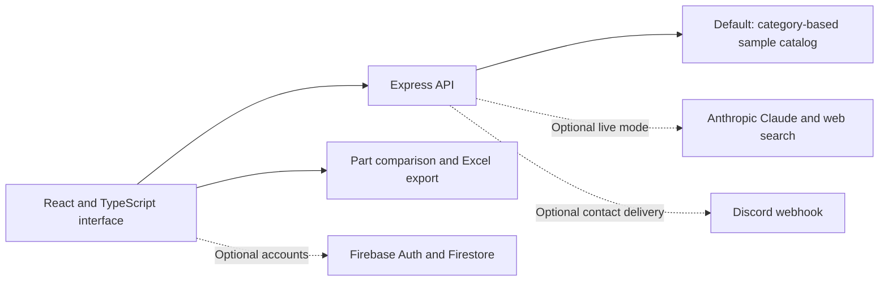

# myPCB AI

**An electronics component-sourcing application with conversational search, part comparison, and Excel BOM export.**

Built with **React 19, TypeScript, Vite, Tailwind CSS, and Express**, with optional Anthropic Claude and Firebase integrations. The responsive green, gold, and cream interface supports desktop and phone demos.

> **Current status:** a working, no-key sample demo. Searches choose predefined category examples; they do not perform live sourcing or validate electrical compatibility. The live AI integration exists but has not been verified with paid API calls. A permanent live demo is not deployed yet.

## What you can try

1. Open the workspace and describe a component requirement, such as **Low-power LDO for 5V to 3.3V conversion**.
2. Review sample cards for LDOs, MOSFETs, microcontrollers, or op-amps. Unsupported categories show a labeled fallback.
3. Select **Compare** on candidate parts to build a side-by-side shortlist.
4. Download all recommendations or only the selected parts as an **Excel BOM**.
5. Open **Manufacturer?** to explore partnerships and download an inquiry brief.

The demo uses no paid model or search calls. Prices, stock, lifecycle, footprint, and suitability remain unverified. Comparison choices last for the current view; downloading a partnership brief sends no inquiry.

## How it works



The backend validates chat payloads and limits requests. Provider responses are parsed into prose and recommendation cards; the UI tolerates malformed recommendation data and filters unsafe supplier links. Model credentials stay on the server. Demo mode is enabled unless explicitly disabled, even if an API key is present.

There is **no custom-trained ML model or RandomForestRegressor**. The sample catalog uses keyword matching; optional live recommendations use a hosted large language model.

## Implemented and optional capabilities

| Capability | Status |
| --- | --- |
| Category-based sample chat | Implemented; no key required |
| Responsive UI and phone manufacturer access | Implemented |
| Comparison shortlist and Excel exports | Implemented |
| Manufacturer partnership brief | Implemented; local download |
| Anthropic recommendations and search | Integration present; paid behavior unverified |
| Firebase sign-in and saved conversations | Integration present; deployment/sign-in unverified |
| Contact delivery | Requires a configured Discord webhook; failures shown honestly |
| Permanent public demo | Not deployed |

## Run locally

Requires **Node.js 20 or newer**. From the repository root:

```bash
npm ci
npm run dev
```

Open **http://localhost:3000** and choose **Launch Workspace**. On Windows, use `npm.cmd` if PowerShell blocks `npm`. Guest sample chat requires no account, Python, or API key.

## Production build

```bash
npm run lint
npm run build
```

Then set `NODE_ENV=production` and run `npm start`. On PowerShell:

```powershell
$env:NODE_ENV = 'production'
npm.cmd start
```

The included Dockerfile runs the frontend and API together. For a Node/container host, use `npm ci && npm run build` as the build command, `npm start` as the start command, and set `NODE_ENV=production` and `DEMO_MODE=true`. The server reads the host's `PORT` variable.

`npm run preview` serves only the frontend, not the chat API. This React/Express project is not a Streamlit application.

## Configuration

Copy `.env.example` to `.env` without overwriting an existing file.

| Variable | Purpose |
| --- | --- |
| `DEMO_MODE` | Defaults to `true`; set `false` only for live AI |
| `ANTHROPIC_API_KEY` | Server-side key for optional paid AI |
| `CLAUDE_MODEL` | Model supported by your Anthropic account; verify compatibility before live use |
| `MAX_WEB_SEARCHES` | Search cap per reply; default 6 |
| `PORT` | Server port; default 3000 |
| `DISCORD_WEBHOOK_URL` | Optional contact delivery |

Restart after changing configuration. Live mode without a key returns **API key required**. A Claude subscription is separate from API billing. Add authenticated quotas and provider budget controls before exposing paid AI publicly; the current 12-request/minute/IP limit is per process.

For accounts, configure your own `firebase-applet-config.json`, Firebase auth providers, authorized domains, and Firestore rules. Firebase client identifiers are public by design, but deployed rules and API restrictions must protect resources. These cloud settings have not been verified from this workspace.

Never commit `.env`, provider credentials, service-account keys, or webhook URLs. Never place server secrets in `VITE_` variables. Local tools, build output, agent settings, and virtual environments are excluded from Git and container uploads.

## Validation and limitations

Typechecking and production builds pass, with a nonblocking bundle-size warning. Local and public HTTPS checks exercised sample searches, health, missing-key behavior, and unconfigured contact errors. Browser visual review, Firebase sign-in, paid AI, and end-to-end download interactions have not been verified.

`/api/health` reports demo and key-configuration status. A temporary Cloudflare tunnel can expose a local production server for phone testing, but requires the computer and tunnel to stay running. It is not a permanent resume link.

## Next steps

- Requirements filters and datasheet-backed electrical compatibility checks.
- Distributor price/stock feeds with timestamps and alerts.
- BOM quantities, project revisions, and shareable review links.
- Clearly labeled manufacturer sponsorships and lead reporting, independent of technical rankings.
- Permanent demo hosting and authenticated live-AI quotas.

For recruiters, use **https://github.com/amartyasnath/mypcb-ai** once the repository is public. Add a stable hosted demo URL later. See [release notes](docs/PUBLIC_RELEASE.md) for the remaining visibility and account settings.
